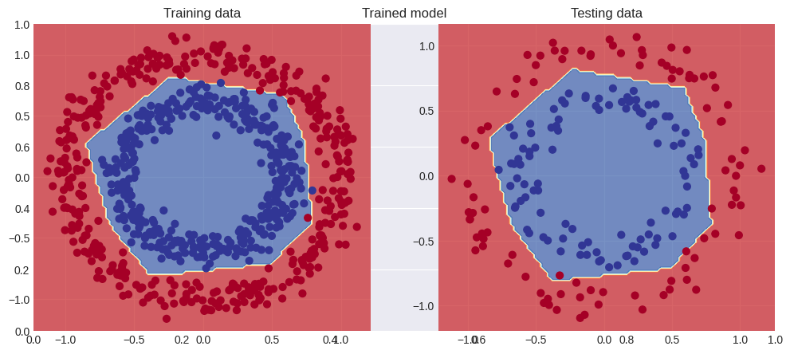

# PyTorch dots

This directory contains some PyTorch classification models for "dots" datasets, such as circles and moons/spirals datasets.

## Example

We have a dataset of circles, generated with SciKit-Learn's make_circles function from sklearn.datasets.

Before training, we can plot the decision boundary using our helper function plot_decision_boundary.

What we got is a randomly generated model's predictions. Basically guessing. To get our desired outcome, we can train it to classify the dots. After training, we get this:

The model is very lightweight, with only 2 linear layers and 1 ReLU layer. Trained with only 500 epochs.

## Overfitting example

`moons-overfit.ipynb` contains an example of overfitting a model. I used a larger and more flexible neural network, trained it for much longer and adjusted learning rate to minimize loss on the training data. What we got is a bit unusual decision boundary plot, with sharp lines and curves.

The accuracy on the training data is *99.50%* which is very good. Although the accuracy on the testing data is *98.00%*. The accuracy on the testing data is not that bad, but consider that the dataset is very simple. Avoiding overfitting we could have gotten much higher testing accuracy.

This is what a good, trained model's decision boundary should have looked like:

It has much smoother lines, much lighter neural network, with less layers and flexibility. Even though the accuracy on the training dataset is *98.62%*, we still manage to get *99.00%* accuracy on the testing dataset.

## Multi-class classification example

This one is fun. We got us here some blobs. Clusters of colored dots:

Now, we can fit this data to a linear model. But it will struggle a bit since we have 5 classes: purple, blue, green, yellow and red. This is what we get when fitting this data to a linear model:

Kinda messy. Although it was trained with 1000 epochs. But trust me, it doesn't get any better with more epochs. Anyway... I made a non-linear model. I trained it for 5000 epochs and got this:

And this is slightly better. Although considering the complexity of this non-linear model, I would say its not worthit to use such model for this task, stick to linear, simple models for simple tasks.

## Spirals dataset

Let me introduce you to our spirals dataset. Generated by our own function using Numpy:

This is an another multi-class classification problem. For this we need a deeper neural network to really catch all the patterns of the dataset. So I used a 4 layer neural network, with leaky ReLU activation functions for the hidden layers, and ofcourse Sigmoid for the 4 output neurons. I used 15 hidden units, which is a lot of this problem, but I wanted to get a pretty decision boundary.

And I got it! Trained over 1000 epochs, the model has learned the pattern of our spiral dataset.

## Tech stack

- **PyTorch** - Main neural network tool
- **SciKit-Learn** - Generating datasets
- **Matplotlib** - Visualizing data