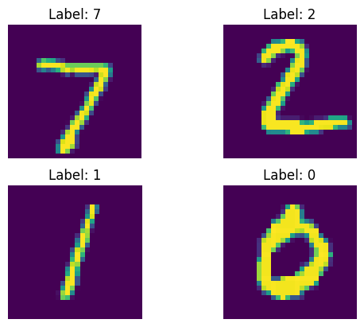

# PyTorch vision

Computer vision solutions with PyTorch. Using multi-layer perceptrons, convolutional neural networks and their different kinds of architectures.

This directory, to me, is a very interesting one. Which is the reason why I put so many comments and headers in my notebooks. I hope they are clear and communicative.

## Multi-layer perceptron

I've went ahead and built a multi-layer perceptron model, which basically means a linear model, to classify handwritten digits from the infamous MNIST dataset. Here's a sample from the dataset:

The model I build has 2 linear layers, an input layer of 784 neurons, and an output layer of 10 neurons, each for their own class, which is a number, we are classifying numbers, from 0 to 9. I've also made a pretty visualization too using this very interesting and useful website called [NN-SVG](https://alexlenail.me/NN-SVG/index.html).

I've truncated the input layer, so that you don't have to see all of the 784 neurons. No need to thank me. The trained model can classify a handwritten number with *93.75%* accuracy. Which is very good for a linear neural network.

## Tech stack

- **PyTorch** - Main neural network tool
- **SciKit-Learn** - Helper functions
- **Matplotlib** - Visualizing data