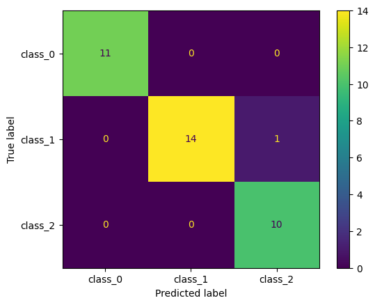
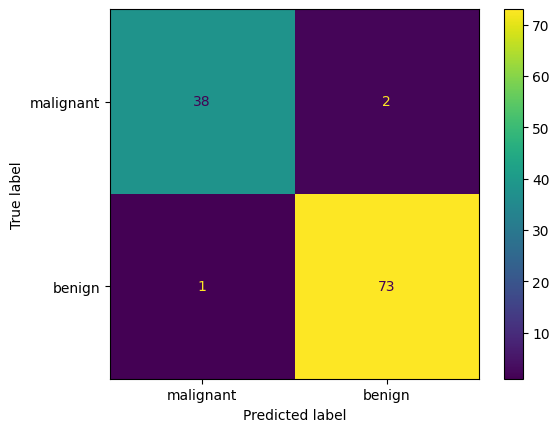
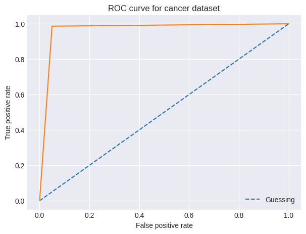

# SciKit-Learn toy

This directory contains some SciKit-Learn estimators for [toy datasets](https://scikit-learn.org/stable/datasets/toy_dataset.html), such as [iris plants](https://scikit-learn.org/stable/datasets/toy_dataset.html#iris-plants-dataset) and [diabetes dataset](https://scikit-learn.org/stable/datasets/toy_dataset.html#iris-plants-dataset).

## Example

We have a iris plants dataset, from `sklearn.datasets` module. Since the dataset is so simple and the `RandomForestClassifier` estimator from `sklearn.ensemble` is very flexible, we get the perfect model.

By plotting the [ROC curve](https://scikit-learn.org/stable/modules/generated/sklearn.metrics.roc_curve.html) we can see that we get the perfect results for every class. Each class has its own plot, although they are all overlapping.

We can also plot the confusion matrix, here we can also see the perfect results. No errors at all.

## Handwritten digits classification

Here's a classic ML exercise. Build a model that can classify images of handwritten digits. The model should be able to recognise monochrome pixel values which make up a handwritten number. Here's a sample from SciKit-Learn's digits dataset:

I used Matplotlib to plot the pixel values to a grid, so that we can visualize the data. What we get is a rough representation of a handwritten digit. It looks like that because its an 8 by 8 image, that means it has only 64 pixels. There's not a lot you can do with just 64 pixels.

Regardless, our trained model was able to classify the images with *94.00%* accuracy, and also get a pretty good looking confusion matrix:

What this confusion matrix is show, is that our model is predicting the true label almost every time. That is why we can see a sort of diagonal line.

## Wine recognition

Recognise wine class based on it's attribute information such as malic asic, total phenols, hue and color intensity, and more. By simply using the `RandomForestClassifer` estimator to fit the dataset, we can predict the classes almost flawlessly.

Here's a confusion matrix of our trained model:

## Breast cancer diagnosis

Using SciKit-learn's **breast cancer wisconsin (diagnostic) dataset** with 569 instances and 30 numeric attributes, such as radius, texturer, perimeter area, etc. I used the `RandomForestClassifier` estimator to fit the dataset. The trained classifier can predict right label with *96.00%* accuracy.

Here's a confusion matrix of our trained model:

Since this is a binary classification problem (meaning that we have only two possible labels, one or zero) we can plot an ROC curve:

