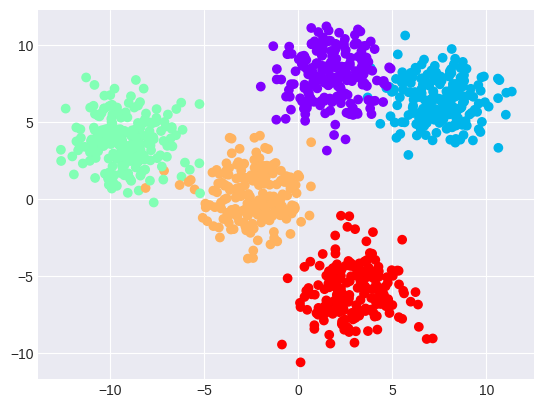
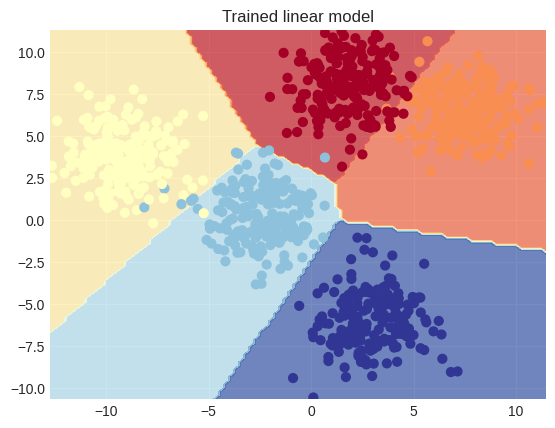

# TensorFlow dots

This directory contains some TensorFlow classification models for "dots" datasets, such as circles and moons/spirals datasets.

## Dots model

We got us here some blobs again. Clusters of colored dots:

We just build a simple model, using `tf.keras.Sequential`. The model has 3 layers. Input layer with 2 neurons, hidden layer with 10 neurons, and an output layer with 5 neurons, corresponding with each class.

I used the `tf.keras.optimizers.Adam` optimizer and `tf.keras.losses.categorical_crossentropy` loss function, and trained it for 50 epochs. The resulting decision boundary plot looks like this:

Which means that it did well (:

## Tech stack

- **TensorFlow** - Main neural network tool
- **SciKit-Learn** - Generating datasets
- **Matplotlib** - Visualizing dataDecision