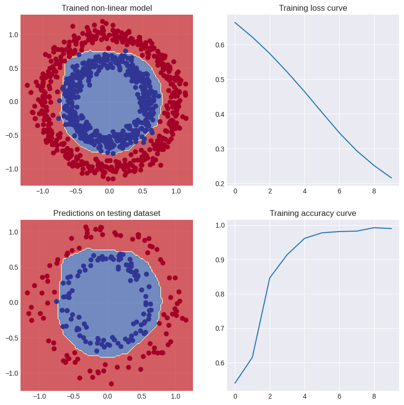

# TensorFlow dots

This directory contains some TensorFlow classification models for "dots" datasets, such as circles and moons/spirals datasets.

## Dots model

We got us here some blobs again. Clusters of colored dots:

We just build a simple model, using `tf.keras.Sequential`. The model has 3 layers. Input layer with 2 neurons, hidden layer with 10 neurons, and an output layer with 5 neurons, corresponding with each class.

I used the `tf.keras.optimizers.Adam` optimizer and `tf.keras.losses.categorical_crossentropy` loss function, and trained it for 50 epochs. The resulting decision boundary plot looks like this:

Which means that it did well (:

## Circles model

This is an classic example of binary classification, which is very cool. Our dataset consists of a lot of dots, colored in red and blue, arranged in a circular shape.

I have built a TensorFlow model to classify the dots color based on it's position. Since our dataset is non-linear, I used the ReLU activation function in the hidden layer of the neural network, with 10 neurons. I have plotted the decision boundary and all the training statistics on one graph:

As you can see by the graphs on the right. The loss value goes down over the iterations, and accuracy goes up with the training time. During training, on last epoch TensorFlow wrote `accuracy: 0.9896 - loss: 0.2139` which means our model performed at `98.96%` accuracy on the training data. Which is good!

## Moons model

This is an another binary classification problem. Here we have, once again, a non-linear dataset from SciKit-learn's toy datasets. A moons dataset, or as I like to call it, spirals! The graph looks like this:

I built a simple TensorFlow sequential model which consists of four layers. The hidden layers both have 10 neurons, so 20 hidden neurons total, the first hidden layers uses the SoftPlus activation function, and the second hidden layer uses the leaky ReLU activation function. Finally we have the Sigmoid activation function at the output. The training statistics and the decision boundary plots looks like this:

The model was trained on only 50 epochs and it is very lightweight. The results are as expected, not perfect, but good enough.

## Tech stack

- **TensorFlow** - Main neural network tool
- **SciKit-Learn** - Generating datasets
- **Matplotlib** - Visualizing dataDecision